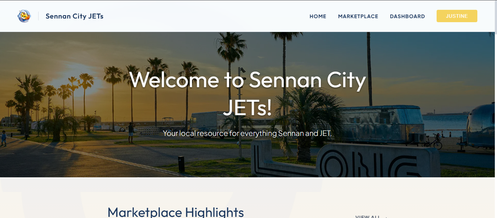
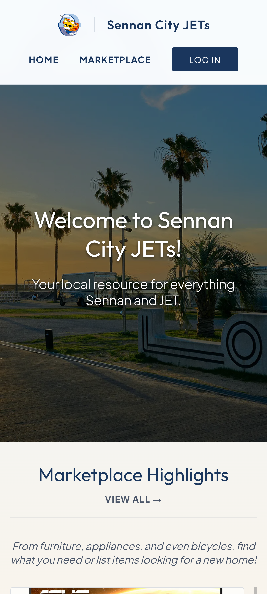
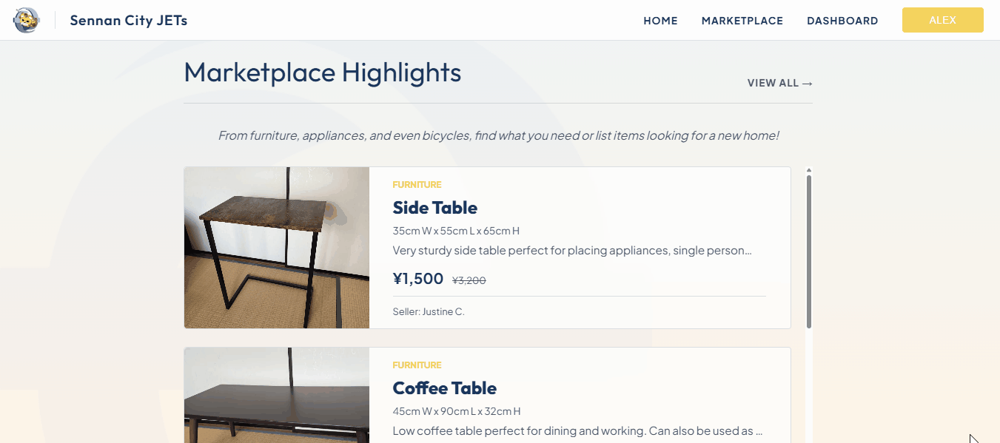
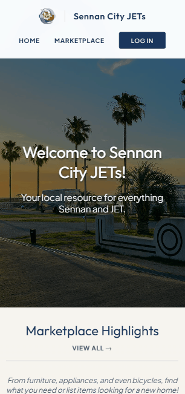
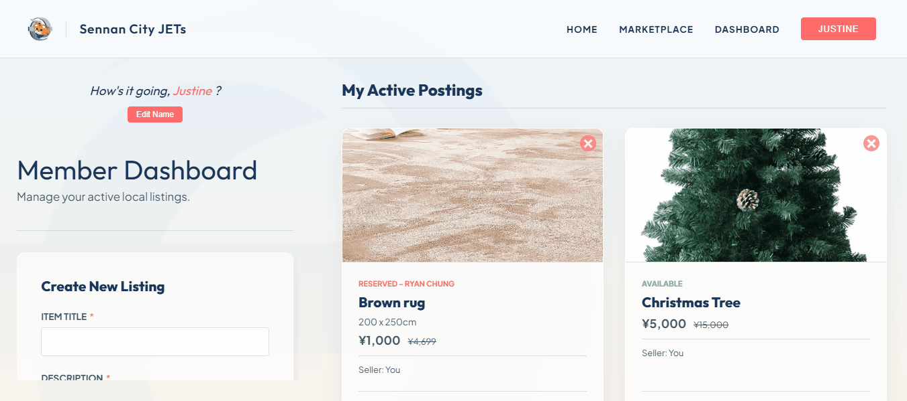
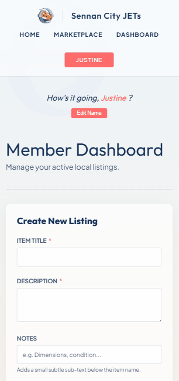
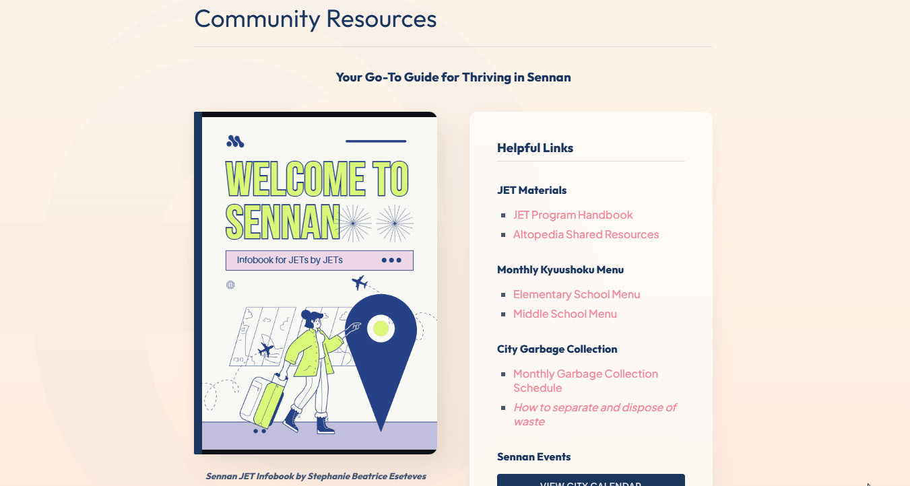
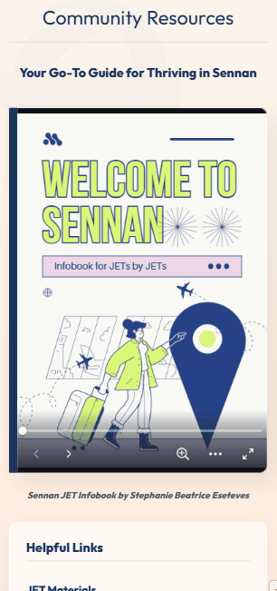
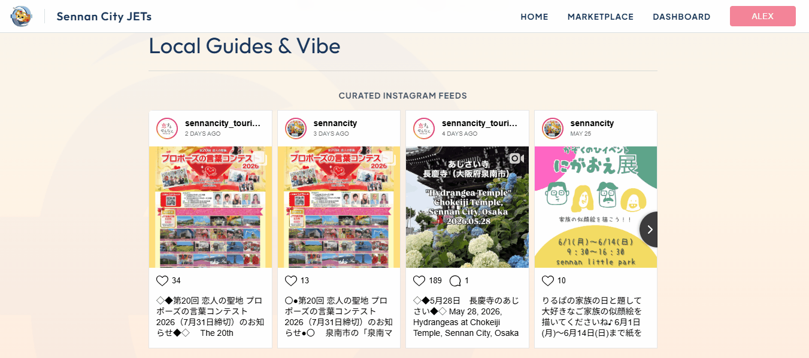
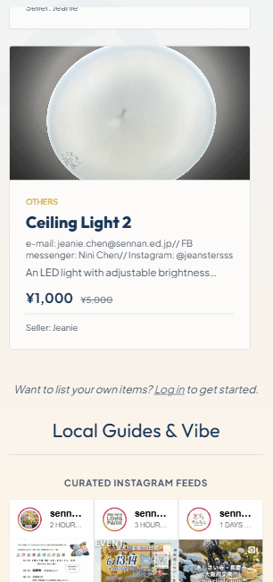

# Sennan City JETs Resource Portal

  🌐 <b>English</b> | <a href="./README.ja.md">日本語</a>

A full-stack web application designed as a centralized hub for Japan Exchange and Teaching (JET) Programme members in Sennan City. The portal streamlines day-to-day workflows by providing instant access to official guides, real-time city updates, an authenticated community marketplace, and a public board for collective announcements.

### 🌐 [Explore the Live Application](https://sennan-jets.up.railway.app/)

---

## 📱 Interface Preview

| Desktop View | Mobile Layout |
| :---: | :---: |
|  |  |

---

## 🚀 Features

### 🛒 Community Marketplace
A dedicated buy/sell ecosystem allowing members to list items or reserve items for purchase.

| Desktop View | Mobile Layout |
| :---: | :---: |
|  |  |

### 🔐 Dynamic User Dashboard
A secure dashboard to manage active listings, update profiles, and track reservations.

| Desktop View | Mobile Layout |
| :---: | :---: |
|  |  |

### 📢 Public Community Board
A live board allowing members to seamlessly drop public announcements, updates, or messages viewable to all visitors.

| Desktop View | Mobile Layout |
| :---: | :---: |
|  |  |

### ⚡ Core Infrastructure
* **Robust User Authentication:** Secure credential-based login and session management to protect community data.
* **Optimized Media Pipeline:** An efficient image processing pipeline that compresses user-uploaded images on the fly before cloud storage.

### 📱 Live Social Feed
Integrated, live-updating embeds capturing Sennan City's Instagram updates and local happenings.

| Desktop View | Mobile Layout |
| :---: | :---: |
|  |  |

---

## 🛠️ Tech Stack

* **Frontend:** HTML5, CSS3, JavaScript (ES6+), EJS (Embedded JavaScript templates)
* **Backend:** Node.js, Express
* **Database & ORM:** PostgreSQL, Prisma ORM
* **Storage & Hosting:** Supabase Storage, Railway

---

## 🧠 Engineering Story: Key Challenges & Takeaways

### 1. Balancing Image Quality with Storage Constraints
* **The Challenge:** Raw smartphone photos (5MB–10MB+) uploaded to the marketplace would rapidly exhaust Supabase free-tier bandwidth and tank page-load performance.
* **The Solution:** Implemented an on-the-fly backend processing pipeline using **Multer** and **Sharp** to intercept, resize, and compress images in server memory before cloud upload.
* **The Takeaway:** Reduced the storage footprint per image by over 70% with negligible quality loss, significantly improving client rendering speeds.

### 2. State Isolation & Secure Dashboard Architecture
* **The Challenge:** Ensuring logged-in users can only modify their own listings and view their specific reservations without leaking state or risking cross-user data contamination.
* **The Solution:** Architected secure, authenticated routes protected by custom middleware validation. Leveraged Prisma ORM to isolate database operations strictly by the user's active session ID (`userId`).
* **The Takeaway:** Achieved solid data security and reliable CRUD operations by enforcing separation of concerns at both the routing and database layers.

### 3. Integrating Live External Feeds
* **The Challenge:** Embedding real-time updates from Sennan City's Instagram feed seamlessly without introducing heavy client-side Cumulative Layout Shift (CLS).
* **The Solution:** Integrated a responsive, sandboxed embed system that dynamically scales across varying viewports while reserving specific layout space.
* **The Takeaway:** Maintained a fluid, polished UI while successfully connecting users to the local community pulse.

---

## 📈 Future Roadmap
* Add automated email notifications when an item is reserved.
* Implement localized real-time weather and disaster alert widgets via public APIs.
* Incorporate a real-time instant messaging system between buyers and sellers.

---

## 📄 License
This project is open-source and available under the [MIT License](LICENSE).
